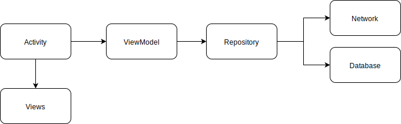
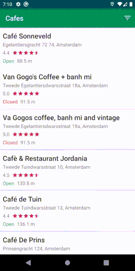
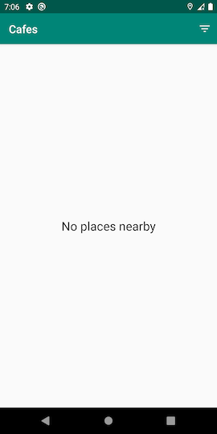

# Places
Simple use case for Places API that shows nearby Cafes, Bars and Restaurants.

## Building the App
1. Get an API Key for the [Places API](https://developers.google.com/places/web-service/get-api-key)
2. Add API Key into `local.properties` with `apiKey` as the variable name.
    ```
    apiKey="<API_KEY>"
    ```
3. Build the app

## Architecture


The app uses a combination of the `repository pattern` and `MVVM` to keep the code testable and maintainable.

* **Repository Pattern** - to have a clear separation between the `Presentation` and the `Data` layer
* **MVVM** - the project uses a variant of MVVM instead of exposing different `LiveData` on different components of the UI, it only exposes a `LiveData` of the representation of the screen. This makes it simpler to manage the state and keep the views passive.
* **Activity as Controller** - the Activity here only acts as an entry point to the application. UI is delegated into separate views as much as possible. The Activity acts as controller to manage the lifecycle, platform specific implementations and to communicate the `ViewModel` and the `View`
* **Views as Components** - views acts as passive representation of state and has few logical decisions as possible. Its only job is to render a state and execute actions. The decision to make use of `findViewById` is to make it simple and context-aware.
* **Dependency Injection** - the project uses a dependency injection container similar to `Dagger`. It's a small project that didn't need the whole features of Dagger but doing it this way makes a fast setup, faster build time, and easier to migrate to Dagger when the project gets bigger.
* **Kotlin Coroutines** - to handle asynchronous calls with simplicity.
* **Offline Mode** -  uses `Room` as cache and uses it when network is not available

## Screenshots
  